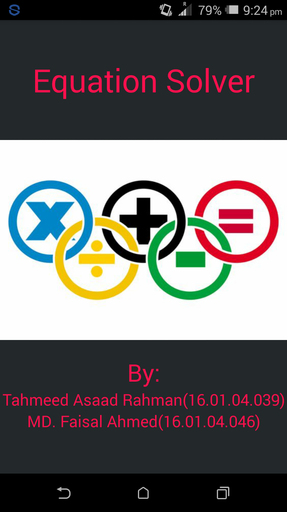
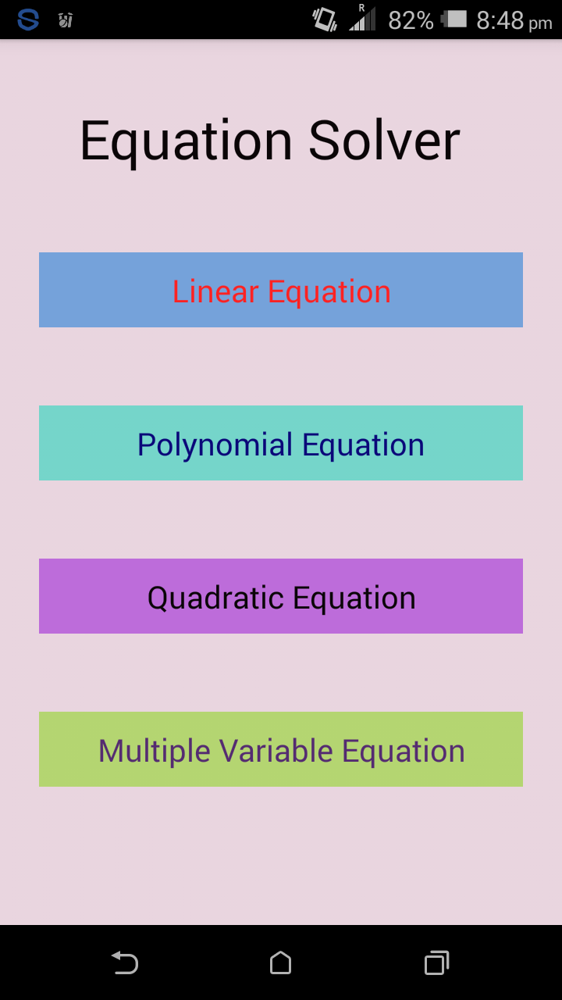
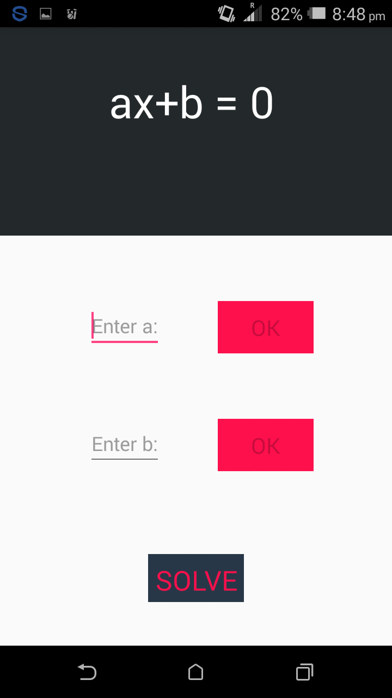
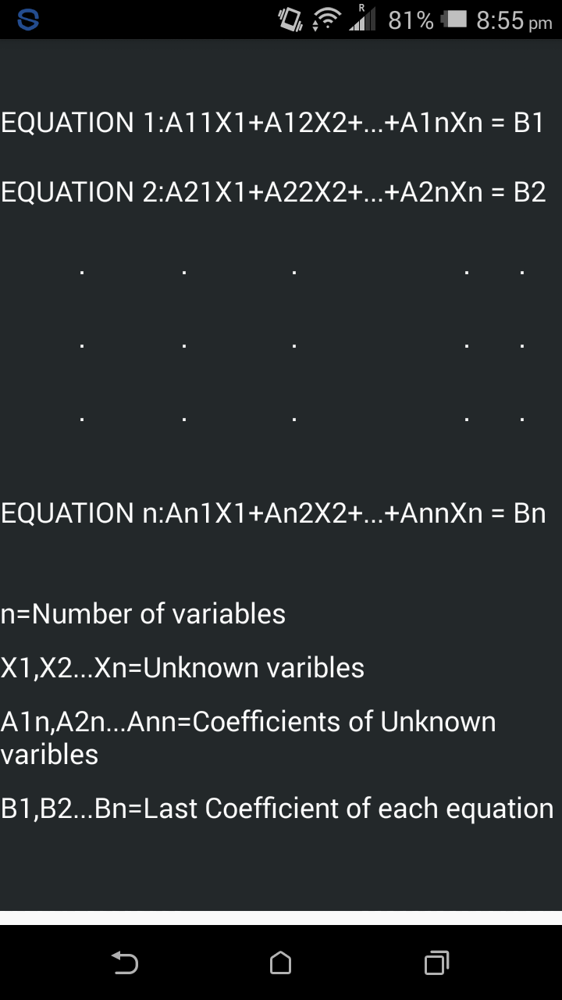
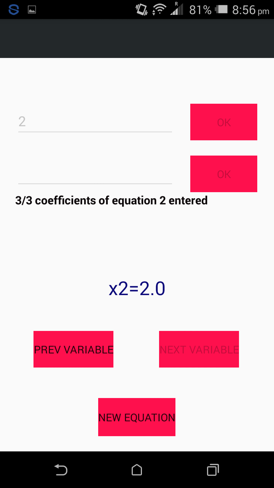
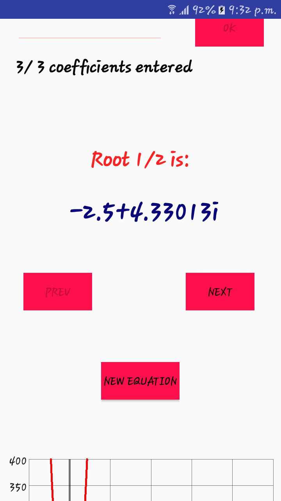
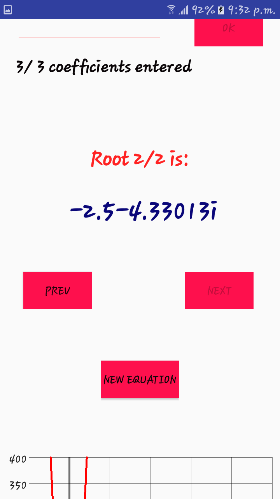
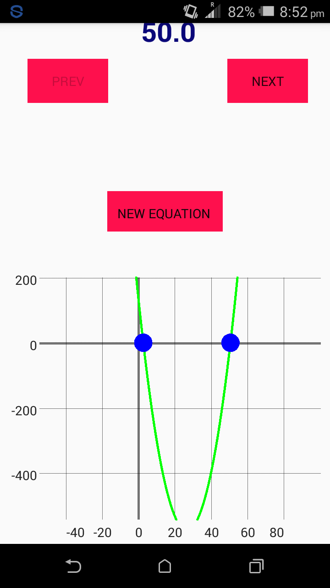

# Equation-Solver

## Table of contents

* [Introduction](#introduction)

* [Features](#features)

* [Technologies](#technologies)

* [Demo Screenshots](#demo-screenshots)

* [Setup](#setup)

* [Working Principle](#working-principle)

## Introduction

This is an android app that can solve four types of mathematical equations. The project targets to build an equation solver that is versatile and can be useful for anyone dealing with mathematical equations.  This group project was built for an undergraduate academic course.

## Features

  *  Can solve linear equations and represent the equations mathematically in their graphical form 
  
  *  Can solve polynomial equations up to 20th degree and represent the equations mathematically in their graphical form 
  
  *  Can solve quadratic equations represent the equations mathematically in their graphical form 
  
  *  Can solve polynomial and quadratic equations which has complex roots 
  
  *  Can solve multiple variable equations
  
 
  
  ## Technologies
  
  * Java
  * Android Studio

  
  ## Demo Screenshots
  

 
 <h1>      </h1>

 

 

 
 
 <h1>      </h1>
 

 

 

 
 
 
 <h1>      </h1>

 

 

 
 
<h1>      </h1>
 

 

 
 
 
 
<h1>      </h1>
 

 

 
 
<h1>      </h1>
 

 

 

 
 <h1>      </h1>

 

 

 
 <h1>      </h1>

 

 

 
 
 
 <h1>      </h1>

 

 

 
 
 
 <h1>      </h1>

 

 

 ## Setup
  'EQUATION SOLVER.apk' should be downloaded to run the app on any android device. Android Studio should be used to build the whole project.
  
 ## Working Principle
 
 This app solves equations by using the Bairstow Method, Gauss Jordan Method and Horner’s Rule. Linear equations, quadratic equations and polynomial equations are solved by using the Bairstow Method. Gauss Jordan Method is applied to find solutions of multiple variable equations. The graphical representation of the equations are done by using the Android Graph View library and Horner’s Rule. 
